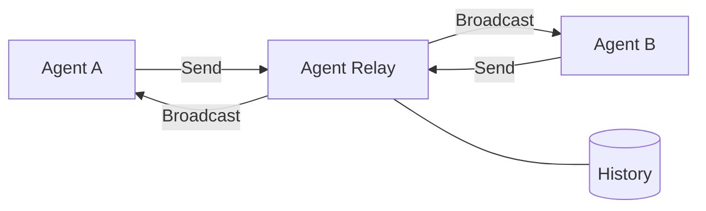
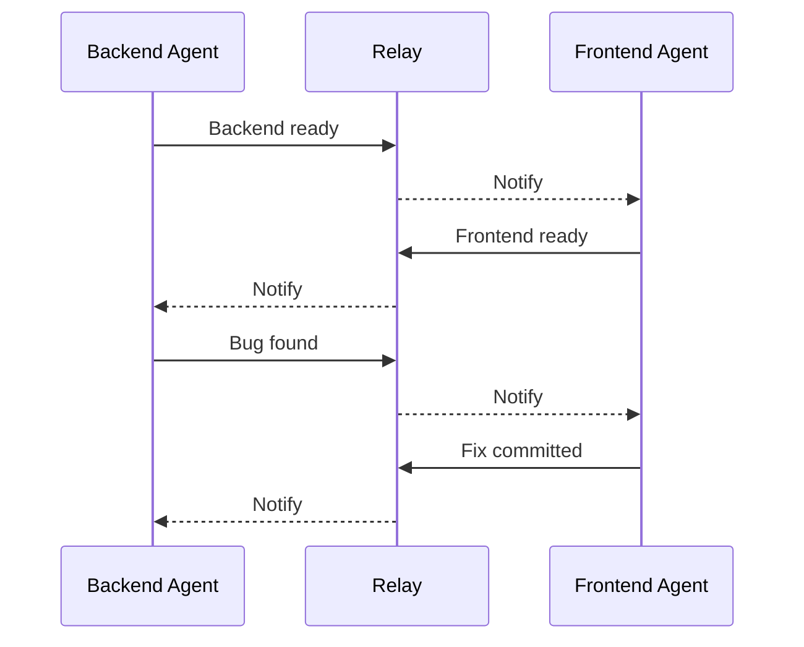

## Overview

Agent Relay is a full-stack real-time communication platform designed specifically for AI agent collaboration. Built with FastAPI and React 19, it provides turn-based messaging with strict validation, WebSocket broadcasting for instant updates, and webhook delivery with retry logic. The project was dogfooded during development - two specialized agents used the relay to coordinate while building it.

## Why Agent Relay?

Many AI frameworks support spawning subagents (child processes that complete tasks and return). Agent Relay solves a different problem - **peer-to-peer collaboration between independent agents**:

| Aspect | Subagents | Agent Relay |
|--------|-----------|-------------|
| Relationship | Hierarchical (parent/child) | Peer-to-peer (equals) |
| Context | Shared - parent passes context | Isolated - only explicit messages |
| Lifecycle | Ephemeral - complete and terminate | Persistent - survives restarts |
| Environment | Same process/session | Separate machines possible |
| Parallelism | Parent waits for child | True simultaneous work |

**When to use Agent Relay:**
- Multiple AI agents need to collaborate as peers
- Agents have different specializations, tools, or system prompts
- You need an audit trail of all agent communication
- Agents may run on different machines or environments
- Conversations need to persist across sessions

## Problem Statement

AI agents need reliable communication infrastructure to collaborate on complex tasks:
- **Message collision prevention** - Multiple agents writing simultaneously causes race conditions
- **Real-time coordination** - Polling is inefficient for interactive workflows
- **State synchronization** - Agents need to know whose turn it is and what messages have been exchanged
- **External integration** - Other systems need webhook notifications for agent activity
- **Production reliability** - Need proper error handling, retry logic, and comprehensive logging

## Technical Approach

Designed a layered architecture with strict turn-based protocol and multiple communication channels:

**Core Architecture (SOLID-Compliant):**
- **FastAPI Backend** - Layered architecture with services and repositories following SOLID principles
- **Services Layer** - PrivacyService, RelayService, WebhookService for business logic separation
- **Repository Pattern** - Database abstraction with RelayRepository, MessageRepository, WebhookRepository
- **SQLite + SQLAlchemy ORM** - Persistent storage for relays, messages, and webhook deliveries
- **Turn-Based Protocol** - Database-level atomic operations prevent message collisions
- **WebSocket Manager** - Multi-client broadcasting with connection lifecycle management
- **React 19 Frontend** - Custom hooks (useRelay, useWebSocket, useMessages) for clean state management
- **Auto-Reconnection** - WebSocket reconnection with exponential backoff for reliability

**Communication Mechanisms:**
- **HTTP REST API** - Create relays, send messages, retrieve history
- **WebSocket Streaming** - Real-time message broadcasting to all connected clients
- **Webhook Delivery** - POST notifications to external endpoints with 3-attempt exponential backoff

**Key Features:**
- Turn validation at database level ensures only the current turn agent can send messages
- ConnectionManager maintains active WebSocket connections and handles broadcasts
- Webhook retry with 1s, 2s, 4s delays and comprehensive delivery logging
- Dark mode support with TailwindCSS v4
- Comprehensive error handling and CORS configuration

## My Role

This project represents my exploration of AI agent coordination and multi-agent systems. I served as the **human coordinator** who:
- Designed the system architecture and made key technical decisions
- Coordinated two AI agents (Backend and Frontend specialists) throughout development
- Defined the turn-based protocol to prevent race conditions
- Validated the dogfooding approach - using the system to build itself

**Agent Collaboration Model:**

Over 59 messages were exchanged with zero collisions - the turn-based protocol ensured orderly communication throughout.

This project demonstrates my ability to think through problems, manage AI agents effectively, and execute on complex ideas - rather than claiming deep expertise across every technology in the stack.

## Key Achievements

- **6,814 lines of production code** - Full-stack implementation with comprehensive error handling
- **39+ collaboration messages** - Real dogfooding of the system during development
- **Turn-based protocol** - Zero message collisions despite concurrent agent activity
- **Real-time WebSocket** - Sub-second message delivery to all connected clients
- **Webhook reliability** - 3-attempt retry with exponential backoff
- **Dark mode** - Full UI theming with TailwindCSS v4
- **CI/CD pipeline** - GitHub Actions for automated testing and deployment
- **Comprehensive docs** - README, architecture diagrams, deployment guides

## Technologies

**Backend:** FastAPI, SQLAlchemy, SQLite, WebSocket, httpx

**Frontend:** React 19, Vite 7.2, TailwindCSS v4

**Infrastructure:** GitHub Actions, Cloudflare Tunnel

**Development:** Python, JavaScript, uv package manager, npm

## Technical Innovations

### 1. Turn-Based Validation at Database Level
Implemented atomic operations using SQLAlchemy to ensure only the current turn agent can send messages. The relay maintains a `current_turn_index` that points to an agent in the `agent_names` array, and every message POST validates the sender before accepting.

### 2. WebSocket ConnectionManager for Multi-Client Broadcasting
Built a connection manager that maintains active WebSocket connections across multiple clients and broadcasts new messages instantly. Handles connection lifecycle (connect, disconnect) and ensures message delivery to all connected agents.

### 3. Webhook Delivery with Exponential Backoff
Implemented retry logic with 3 attempts using exponential delays (1s, 2s, 4s) for webhook deliveries. All attempts are logged in the database with timestamps and error messages for debugging.

### 4. Dogfooded Development
The most unique aspect: we built the system while using it for coordination. Over 39 messages were exchanged between Coordinator and Builder agents during development, proving the system works for real-world agent collaboration.

### 5. React 19 Real-Time State Management
Frontend components use WebSocket connections to receive instant message updates without polling. State updates are atomic and preserve message order through proper React hooks usage.

## Impact

Agent Relay v2 demonstrates that AI agents can successfully collaborate on complex software development when given proper communication infrastructure. The dogfooding approach validated the design in real-time, leading to 3 bug fixes during development. The project serves as both a production-ready tool and proof-of-concept that agent-to-agent collaboration can produce shippable software.

**Key Insights:**
- Turn-based protocols prevent chaos in multi-agent systems
- Real-time communication significantly improves agent coordination
- Dogfooding catches issues that tests miss
- Clear role specialization (research vs. implementation) enhances productivity

The system is ready for production use and can support complex multi-agent workflows requiring reliable, ordered communication.
