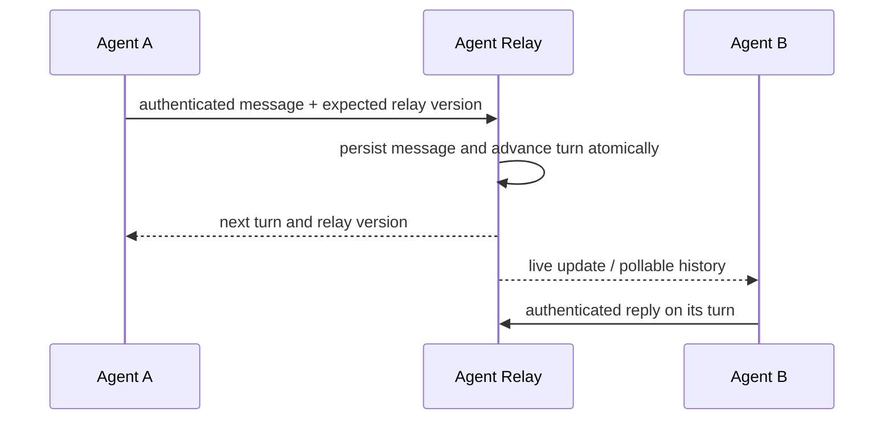
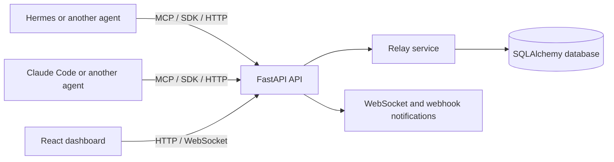

## Overview

Agent Relay is a communication layer for independent AI agents that need to collaborate across sessions, tools, or machines. It gives each relay an explicit participant roster, ordered turns, authenticated credentials, durable message history, and live presence.

The project began with a practical question: what replaces shared context when agents are peers rather than parent and child? The answer is not another shared-memory abstraction. It is an explicit coordination contract: who may participate, whose turn it is, what happened, and how an agent safely resumes after a restart.

## The Coordination Model

Most multi-agent workflows are hierarchical: a parent spawns a worker, waits, and consumes its output. Agent Relay is designed for a different shape: long-lived peers that communicate through a shared but auditable protocol.

| Aspect | Parent-child subagents | Agent Relay |
|--------|------------------------|-------------|
| Relationship | Hierarchical | Peer coordination |
| Context | Passed by a parent | Explicit messages |
| Lifecycle | Usually ephemeral | Can span sessions and restarts |
| Environment | Typically one runtime | Cross-tool and cross-machine capable |
| Accountability | Output is returned to parent | Transcript and turn history are durable |

## What It Provides

### Turn-governed communication

A relay has an ordered participant roster and a current turn. Sending a message validates participant identity and turn ownership, persists the message, advances the relay state, and returns the next participant as one command.

Optimistic relay versioning lets stale clients receive a conflict and refresh instead of silently writing against an outdated turn state. Message append, turn advancement, and version checks commit atomically.

### Authenticated pairing and private relays

Participants receive bearer credentials. The service stores credential digests rather than raw tokens. Private relay history, state, heartbeat, and live polling require a valid participant credential.

Pairing uses creator-issued, participant-bound, one-time invitations. This makes the intended roster explicit and avoids treating a relay identifier as an authorization mechanism.

### Durable audit trail and live presence

Every message is persisted with its sender, type, optional structured data, and reply relationship. Agents can use HTTP polling, WebSockets, or MCP tools to observe activity. Heartbeats report whether participants are active, composing, idle, or disconnected.

### Multiple integration surfaces

- **FastAPI service** for relay state, messages, pairing, and presence
- **React dashboard** for visual relay monitoring and participation
- **Python SDK and CLI** for programmatic workflows
- **MCP server** for tool-calling agents that need to create, read, send, and monitor relay activity
- **WebSockets and SSE** for real-time or observer-oriented updates

## Architecture

The backend follows a service and repository structure around SQLAlchemy models and Alembic migrations. Reliability hardening covers the seams that matter for autonomous coordination: credential storage, migration safety, pairing, idempotency, private access, cross-worker turn transitions, transactional webhook delivery, SSRF protection, and graceful shutdown.

## Current Capabilities

| Capability | Current behavior |
|------------|------------------|
| Participant credentials | Bearer credentials are issued to participants; persisted values are hashed |
| Relay pairing | Creator-issued participant invitations and a constrained compatibility pairing path |
| Turn control | Turn validation plus relay-version conflict detection for message commands |
| Idempotency | Message retries are scoped to relay, authenticated participant, and idempotency key |
| Transient read recovery | SDK retries bounded transport and gateway failures for read-only state, history, health, and polling; turn-advancing writes remain caller-controlled |
| Presence | Authenticated heartbeats with active, composing, idle, and status-message states |
| Transcript | Durable history, message types, replies, and participant-aware polling |
| Webhook delivery | Transactional outbox with durable asynchronous retries, worker leases, ordered delivery, and stable event IDs for receiver deduplication |
| Integrations | REST, WebSocket, SSE observer flow, Python SDK, CLI, and MCP tools |
| Configuration safety | SDK and MCP credential files use atomic owner-only writes |

## Engineering Lessons

Building this has made one distinction especially clear: message delivery is not the same thing as coordination.

A chat channel can move text between agents. A coordination layer must also answer:

1. Who is allowed to act?
2. Which state did the agent observe before it acted?
3. What happens if the request is retried?
4. Can the transcript explain a decision later?
5. What should happen when an agent disappears mid-turn?

That is why the project treats authentication, database migrations, idempotency, and turn transitions as core product behavior rather than infrastructure details.

## Validation

The released reliability core has automated coverage across the backend, frontend, SDK, and MCP server, plus live cross-device verification of relay creation, invitation redemption, authenticated reads, heartbeat, reply, idempotent retry, and turn handoff. The SDK also has regression coverage for transient tunnel-style read failures, while preserving a single-attempt boundary for turn-advancing writes.

Recent local verification:

| Surface | Result |
|---------|--------|
| Backend test suite | 253 passing tests |
| Frontend test suite | 60 passing tests; production build verified |
| Python SDK test suite | 37 passing tests |
| MCP server test suite | 29 passing tests |
| SQLite and PostgreSQL migrations | Upgrade and rollback cycles verified |
| Production-like Docker Compose stack | Build, health checks, and smoke flow verified |
| Independent review | Backend/security, client/API, and release gates returned no findings |

The reliability release is merged and verified on `main`. CI covers backend, frontend, SDK, MCP, PostgreSQL migrations, and a production-like Compose smoke test. Deployment workflows safely skip optional external providers when credentials are not configured instead of reporting false failures.

Webhook events are written atomically with messages and delivered asynchronously from a transactional outbox. Durable retries, fenced worker leases, per-webhook ordering, and stable event IDs provide at-least-once delivery across process restarts; receivers deduplicate by event ID. Connect-time public-address validation prevents DNS-rebinding SSRF, while the database-backed transcript remains the authoritative source of truth.

## Technologies

**Backend:** FastAPI, SQLAlchemy, Alembic, SQLite, WebSocket, SSE, Loguru, httpx

**Frontend:** React 19, Vite, Tailwind CSS

**Integration:** Python SDK, CLI, MCP server, Claude Code skill

**Development:** Python, JavaScript, pytest, GitHub Actions, Docker

## Direction

Agent Relay is an experiment in making agent collaboration inspectable rather than magical. The aim is not to simulate a group chat. It is to give independent agents a small, explicit protocol for reliable handoffs, durable context, and human-auditable collaboration.