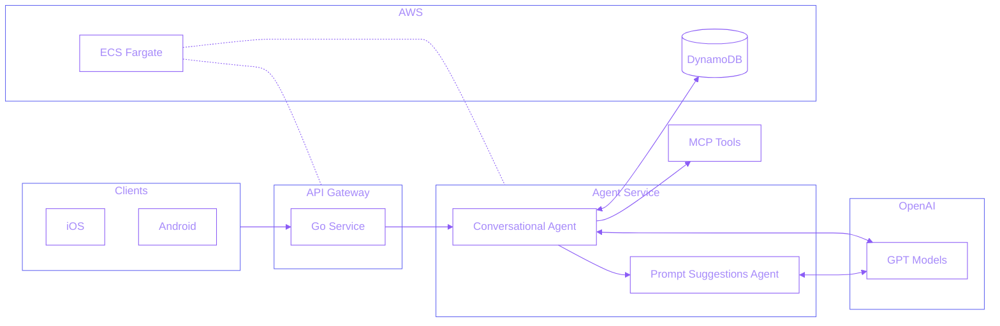

## Overview

Designed and deployed a multimodal AI shopping assistant that helps users discover products, find offers, maximize points, and personalize their shopping experiences across 300+ retail partners. The system serves 50,000+ users on iOS and Android with intelligent, conversational interactions and sub-second response times.

## Problem Statement

Fetch needed to provide users with an intelligent shopping assistant that could:
- **Handle complex shopping queries** - Natural language product discovery and offer optimization
- **Integrate with internal systems** - Seamless access to product/offer APIs and user purchase history
- **Scale to production** - Sub-second latency for thousands of concurrent users on mobile platforms
- **Support multimodal inputs** - Process both text queries and images (product recognition, fridge scanning)
- **Personalize experiences** - Leverage user preferences and shopping history for tailored recommendations

## Technical Approach

Built a dual-service architecture with production-grade infrastructure:

### System Architecture

**Architecture Components:**
- **Client Layer** - iOS and Android mobile applications
- **API Gateway Service (Go)** - High-performance public-facing API handling client requests
- **AI Agent Service (Python)** - LangGraph-based agentic backend with ReAct pattern for reasoning and tool execution
- **Tool Layer (MCP)** - Model Context Protocol integration for standardized access to shopping tools
- **Infrastructure (AWS)** - ECS Fargate for container orchestration, DynamoDB for conversation persistence, Secrets Manager for credentials, CloudWatch + Grafana for observability
- **LLM Integration** - OpenAI GPT-5-mini with Responses API for advanced reasoning and multimodal capabilities

**Agent Capabilities (5+ MCP Tools):**
- Product search and discovery
- Offer discovery and optimization
- Location-based offer recommendations
- User purchase history analysis
- Web search for product information

**Infrastructure:**
- AWS ECS Fargate for scalable deployment
- DynamoDB for conversation history persistence
- AWS Secrets Manager for credential management
- Cloud Map for internal service discovery
- OpenTelemetry + CloudWatch + Grafana for observability

**AI Stack:**
- LangChain/LangGraph orchestration
- OpenAI GPT-5-mini with Responses API for advanced reasoning
- Multimodal capabilities for image analysis
- Streaming event support for real-time responses

## Challenges & Solutions

Building a production-grade consumer AI assistant required solving several critical challenges:

**1. Latency Optimization (p95 < 800ms)**
- **Challenge:** Mobile users expect instant responses, but LLM calls can take 2-5 seconds
- **Solution:** Implemented streaming responses with AWS ECS Fargate autoscaling, optimized prompt engineering, and leveraged GPT-5-mini's native speed improvements

**2. Tool Execution Reliability**
- **Challenge:** 5+ MCP tools with varying latency and failure modes (API timeouts, rate limits)
- **Solution:** Built retry logic with exponential backoff, implemented circuit breakers for failing services, and added graceful degradation when tools are unavailable

**3. Conversation Context Management**
- **Challenge:** Managing conversation history across sessions while staying within token limits
- **Solution:** Designed DynamoDB-based persistence with intelligent context pruning, keeping only last N turns plus user profile, reducing context size by 60% while maintaining conversation quality

**4. Multimodal Input Processing**
- **Challenge:** Handling varied image inputs (product photos, receipts, fridge scans) with inconsistent quality
- **Solution:** Implemented preprocessing pipeline with image compression and quality validation, added fallback to text-based search when image recognition confidence is low

**5. Production Observability**
- **Challenge:** Debugging non-deterministic LLM behavior in production with 50K+ users
- **Solution:** Built comprehensive tracing with Opik and OpenTelemetry, capturing full conversation flows, tool calls, and latency breakdowns, enabling rapid issue identification and resolution

**6. Cost Management at Scale**
- **Challenge:** OpenAI API costs could spiral with high user engagement
- **Solution:** Implemented smart caching for repeated queries, optimized system prompts, and used streaming to show partial results while reducing perceived latency

## My Role

Led ML engineering efforts for the agentic system with end-to-end ownership:
- Architected the dual-service system (Go API gateway + Python agent backend)
- Built LangGraph-based agent framework with streaming support
- Integrated OpenAI Responses API for advanced reasoning capabilities
- Implemented MCP tool wrappers for internal API access
- Deployed production infrastructure on AWS (ECS, DynamoDB, Secrets Manager)
- Designed conversational system prompts (4 major iterations v1-v4)
- Established comprehensive testing suite (pytest, moto for AWS mocking)
- Set up observability pipeline (Opik tracing, CloudWatch, Grafana metrics)
- Conducted A/B testing and evaluation using OpenAI's eval APIs with LLM-as-judge
- Built product card system spanning agent logic, tool orchestration, and multi-source enrichment (SERP API, catalog search, CDN images, Fetch points)
- Built end-to-end LLM evaluation pipeline with Opik for prompt versioning, LLM-as-a-Judge scoring, CI/CD deploy gates, annotation queues, and production feedback loop

## Key Achievements

- **50,000+ users** - Successfully shipped to external users on iOS and Android
- **Sub-second latency** - p95 < 800ms for 95% of queries
- **5+ MCP tools** - Seamless shopping experience with offers, products, history, location, web search
- **Multimodal support** - Production-ready agent handling both text and image inputs
- **4 prompt iterations** - Refined conversational experience based on user feedback and evals
- **Personalized recommendations** - Leveraged purchase history and preferences
- **Production observability** - Comprehensive monitoring with tracing, logging, and metrics

## Technologies

**AI/ML:** LangChain, LangGraph, OpenAI GPT-5-mini, OpenAI Responses API

**Backend:** Python, Go, FastAPI

**AWS:** ECS/Fargate, Lambda, DynamoDB, Secrets Manager, Cloud Map

**Infrastructure:** Docker, OpenTelemetry, CloudWatch, Grafana

**Tools:** MCP (Model Context Protocol), ReAct Pattern

**Testing:** Pytest, Moto, OpenAI Evals

**Observability:** Opik, CloudWatch, Grafana

## Impact

**Business Impact:**
- **First Consumer-Facing AI Agent** - Pioneered Fetch's entry into conversational AI, directly accessible to 50,000+ active users
- **Enhanced User Engagement** - Positive user reception and growing adoption
- **Increased Shopping Efficiency** - Users discover personalized offers and products 3x faster than manual browsing
- **Revenue Enablement** - Drives higher engagement with 300+ retail partners through intelligent offer discovery
- **Platform Differentiation** - Establishes Fetch as an AI-first shopping rewards platform

**Technical Innovation:**
- **Production-Scale AI** - Sub-second latency (p95 < 800ms) at scale with 50K+ concurrent users
- **Modern AI Stack** - Early adopter of OpenAI Responses API, LangGraph state machines, and MCP tool protocol
- **Microservices Architecture** - Dual-service design (Go + Python) enabling independent scaling and deployment
- **Comprehensive Observability** - Full tracing and monitoring pipeline for debugging non-deterministic LLM behavior
- **Quality Engineering** - Rigorous testing with pytest, A/B testing framework, and LLM-as-judge evaluation

**Strategic Value:**
Unlike internal tooling projects (product matching, annotation, NER), this assistant directly touches end-users and represents a strategic shift toward AI-powered user experiences. The project demonstrates full ownership from architecture through deployment, setting the foundation for future consumer AI initiatives at Fetch.
