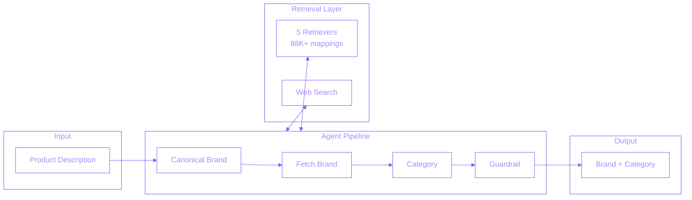

## Overview

Built a multi-agent system that automatically predicts brands and hierarchical categories for unmapped product descriptions. The system resolves ambiguity, handles abbreviations, and avoids hallucinations while enabling downstream catalog enrichment and offer targeting.

## Problem Statement

Thousands of product descriptions (SPDs) existed in Fetch's database without assigned brands or categories, preventing them from being matched to catalog items. Challenges included:
- **Ambiguous descriptions** - "org milk" could be multiple brands
- **OCR errors** - Misspellings and artifacts from receipt scanning
- **Abbreviations** - Non-standard shorthand ("flz" for fluid ounces)
- **Hierarchical categories** - Navigating multi-level taxonomy
- **Hallucination risk** - LLMs inventing plausible but incorrect brands

## Technical Approach

Developed an agentic system with LangGraph orchestration featuring four specialized agents:

### System Architecture

**Agent Architecture:**
- **CanonicalBrandAgent** - Extracts standardized brand names
- **FetchBrandAgent** - Maps to company-specific brand catalog
- **CategoryAgent** - Assigns hierarchical category with hallucination detection
- **WorkflowGuardrailAgent** - Validates outputs and catches errors

**Retrieval System (5 specialized retrievers):**
- Abbreviation mappings (24K+ entries)
- Brand knowledge base
- Category taxonomy navigation
- Error history for learning from past mistakes
- Semantic and lexical search components

**Web Search Integration:**
- Gemini 2.5 Flash with Google Search for ambiguous products
- OpenAI Responses API for real-time lookups
- Fallback mechanisms for edge cases

## My Role

Architected and implemented the complete multi-agent system:
- Designed the agent workflow and interaction patterns
- Created retriever architecture with semantic + lexical search
- Built guardrail system to prevent hallucinations
- Integrated multiple LLM providers (OpenAI, Anthropic, Google)
- Established category tree navigation tools
- Deployed on production infrastructure for real-time inference

## Key Achievements

- **15K+ mappings** - Successfully predicted brands and categories for previously unmapped SPDs
- **88% brand accuracy** - High precision on brand prediction task
- **85% category accuracy** - Reliable hierarchical classification
- **12% improvement** - Error-learning system increased accuracy over 3 months
- **Catalog enrichment** - Enabled downstream offer targeting and recommendations
- **Framework reuse** - Agentic pattern adopted by other Fetch teams

## Technologies

**AI/ML:** LangChain, LangGraph, OpenAI, Anthropic Claude, Google GenAI

**ML Infrastructure:** Sentence Transformers, FuzzyWuzzy, FAISS

**Backend:** Python, Pydantic, Snowflake

**Search:** Semantic + lexical hybrid search, web search integration

## Impact

This system unlocked value from thousands of previously unmapped products, enabling more accurate offer targeting and improved user experience. The error-learning mechanism created a virtuous cycle where the system continuously improved from production feedback. The multi-agent framework became a reusable pattern across the organization.
