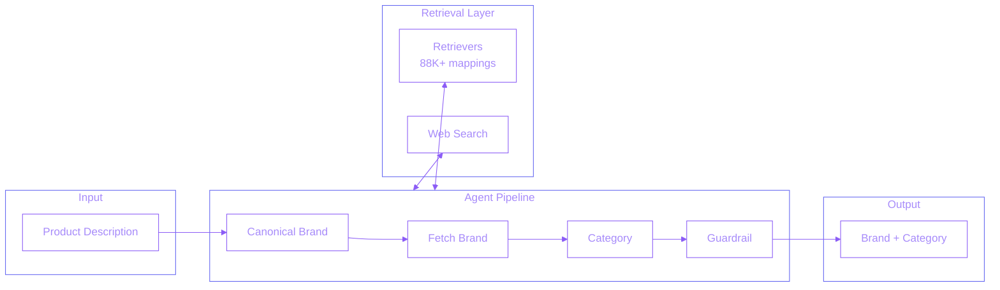
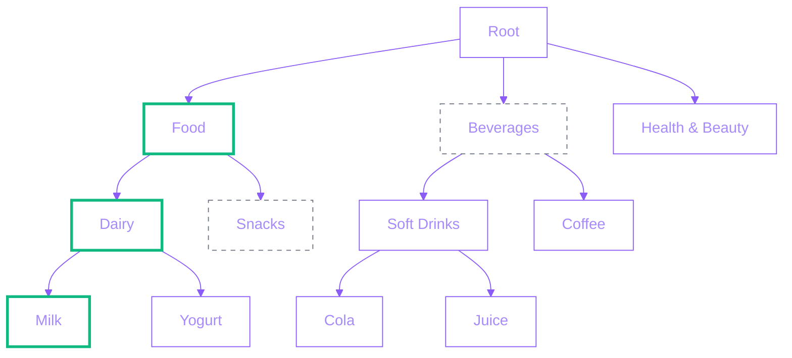
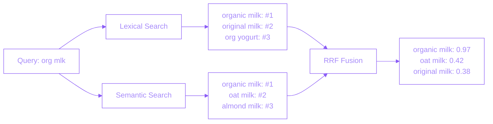
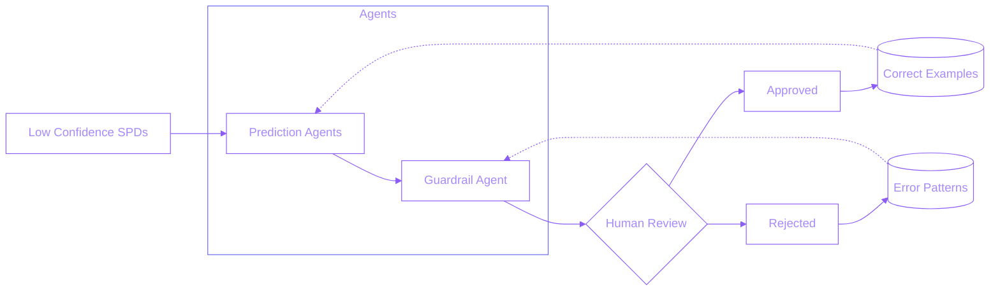

## Overview

Built a multi-agent system that automatically predicts brands and hierarchical categories for unmapped product descriptions. The system resolves ambiguity, handles abbreviations, and avoids hallucinations while enabling downstream catalog enrichment and offer targeting.

## Problem Statement

Thousands of product descriptions (SPDs) existed in Fetch's database without assigned brands or categories, preventing them from being matched to catalog items. Challenges included:
- **Ambiguous descriptions** - "org milk" could be multiple brands
- **OCR errors** - Misspellings and artifacts from receipt scanning
- **Abbreviations** - Non-standard shorthand ("flz" for fluid ounces)
- **Hierarchical categories** - Navigating multi-level taxonomy
- **Hallucination risk** - LLMs inventing plausible but incorrect brands

## Technical Approach

Developed an agentic system with LangGraph orchestration featuring four specialized agents:

### System Architecture

**Agent Architecture:**
- **CanonicalBrandAgent** - Extracts standardized brand names
- **FetchBrandAgent** - Maps to company-specific brand catalog
- **CategoryAgent** - Assigns hierarchical category with hallucination detection
- **WorkflowGuardrailAgent** - Validates outputs and catches errors

**Retrieval System:**
- Abbreviation mappings
- Brand knowledge base
- Category taxonomy navigation
- Error history for learning from past mistakes
- Web search for ambiguous products

**Web Search Integration:**
- Gemini 2.5 Flash with Google Search for ambiguous products
- OpenAI Responses API for real-time lookups
- Fallback mechanisms for edge cases

## My Role

Architected and implemented the complete multi-agent system:
- Designed the agent workflow and interaction patterns
- Created retriever architecture with semantic + lexical search
- Built guardrail system to prevent hallucinations
- Integrated multiple LLM providers (OpenAI, Anthropic, Google)
- Established category tree navigation tools
- Deployed on production infrastructure for real-time inference

## Technical Innovations

### 1. Beam Search Category Navigation

Implemented beam search for navigating hierarchical category trees with 6+ depth levels. Agents explore multiple category paths simultaneously with confidence-based stopping, allowing predictions at any depth rather than forcing terminal categories when uncertain.

*Beam=2: Explores top 2 paths at each level (solid), prunes others (dashed)*

### 2. RRF Hybrid Retrieval

Combined lexical search (fuzzy matching) with semantic search (embeddings) using Reciprocal Rank Fusion. The hybrid approach handles both exact abbreviation matches ("org" to "organic") and semantic similarity for brand disambiguation.

*Reciprocal Rank Fusion combines rankings from both retrievers*

### 3. Active Learning Feedback Loop

SPDs that fall below the ML model's confidence threshold are routed to the agent pipeline for prediction. Human reviewers validate these predictions, and feedback flows back into the system - correct predictions become reference examples for similar future cases, while errors become patterns for the guardrail to catch.

*SPDs below ML confidence threshold go to agents; human feedback improves future predictions*

### 4. Cross-Agent Validation

Implemented a guardrail agent that validates coherence across all pipeline predictions, checking for logical consistency (e.g., "Coca-Cola" brand should map to "Beverages" category, not "Pet Food").

### 5. Hierarchical Path Validation

Hallucination prevention through grounded validation. When agents predict a category, the path is validated against the actual taxonomy tree. If the category doesn't exist or the path is incorrect, validation fails and the agent retries with a valid category - ensuring all predictions are grounded in real taxonomy entries rather than plausible-sounding hallucinations.

## Key Achievements

- **$165M GMV unlocked** - Enabled offer targeting for previously unmapped products
- **15K+ mappings** - Successfully predicted brands and categories for previously unmapped SPDs
- **15% full automation** - Conservative guardrail filters high-confidence predictions (97%+ accuracy) for full automation without human review
- **88% brand accuracy** - High precision on brand prediction task
- **85% category accuracy** - Reliable hierarchical classification
- **50+ hours → 2 minutes** - Automated manual mapping operations
- **Framework reuse** - Core agents adopted for CatOps catalog cleanup system

## Technologies

**AI/ML:** LangChain, LangGraph, OpenAI, Anthropic Claude, Google GenAI

**ML Infrastructure:** Sentence Transformers, FuzzyWuzzy, FAISS

**Backend:** Python, Pydantic, Snowflake

**Search:** Semantic + lexical hybrid search, web search integration

## Impact

This system unlocked value from thousands of previously unmapped products, enabling more accurate offer targeting and improved user experience. The error-learning mechanism created a virtuous cycle where the system continuously improved from production feedback.

**Framework Adoption:** The multi-agent architecture became a foundational pattern for the organization. Another engineer on the team leveraged the core agents (Canonical Brand, Fetch Brand, Category) and retriever infrastructure to build CatOps Automation - a larger system for Receipt Quality catalog data cleanup. By reusing the proven agent patterns, retrievers, and category navigation tools, the CatOps project accelerated development significantly rather than building from scratch.
