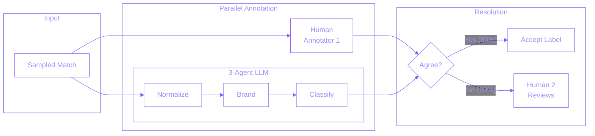

## Overview

Built a 3-agent annotation workflow using LangGraph to generate training data for the PAM-ML product matching model. The workflow replaces the second human annotator in the traditional double-annotation process.

**How it works:** The ML model matches receipt products to catalog items. The quality team samples these matches for labeling to create training data. Previously, two humans annotated each sample and a third resolved disagreements. Now the LLM acts as the second annotator - when it agrees with the first human (80%+ of cases), the label is accepted. The second human only reviews the 20% disagreement cases.

## Problem Statement

Training ML models for product matching required thousands of labeled examples with high agreement between annotators. The traditional double-annotation process was expensive and slow:
- **Double cost** - Every example needed two human annotators
- **Scale bottleneck** - Limited throughput due to human capacity
- **Disagreement handling** - Third annotator needed to break ties
- **Quality standards** - Required high inter-annotator agreement
- **Consistency** - Human annotators had subjective interpretation differences

## Technical Approach

Built a 3-agent workflow with LangGraph orchestration:

### System Architecture

**3-Agent Pipeline:**
1. **Product Normalization Agent** - Expands abbreviated receipt/catalog descriptions into full product names
2. **Brand Name Agent** - Extracts and validates brand names from normalized descriptions
3. **Annotation Agent** - Classifies match quality on 0-4 scale using decision tree reasoning

**Why 3 agents?** Breaking the complex annotation task into focused steps improves accuracy. Each agent specializes in one aspect: normalization handles messy text, brand extraction isolates a key comparison factor, and classification applies consistent decision logic. This also provides interpretable intermediate outputs for debugging.

**Classification Scale:**
- 0: Completely Incorrect (brand mismatch)
- 1: Partially Incorrect (brand correct, product details wrong)
- 2: Overly Specific (extra unverifiable details)
- 3: Somewhat Correct (missing some details)
- 4: Exactly Correct (perfect match)

**Human-LLM Agreement System:**
- First human annotator labels the sample
- LLM (3-agent workflow) independently labels the same sample
- Agreement (80%+ of cases): label accepted automatically
- Disagreement (20% of cases): second human annotator reviews and resolves

**Explainability Metadata:**
Each prediction includes structured reasoning:
- Common information between receipt and catalog product
- Missing information gaps
- Extra unverifiable details
- Incorrect/contradicting information
- Decision tree trace showing the classification path
- Textual justification for the final label

## Key Achievements

- **80%+ LLM accuracy** - LLM matches human annotator judgment across all labels
- **40% total workload reduction** - From 2 annotators to 1 + LLM (human reviews only 20% disagreements)
- **Quality maintained** - Human oversight on edge cases preserves dataset quality
- **Explainable outputs** - Decision tree traces and justifications for every prediction
- **Reusable framework** - Internal LLM library (agents, workflows) adopted by False Positive Auditor and other projects

## Technologies

**AI/ML:** LangGraph, OpenAI models

**Framework:** Python, Pydantic

**Infrastructure:** JFrog (internal package registry)

**Data:** Structured outputs, decision tree reasoning

## Impact

This workflow transformed the annotation process from requiring two humans per example to a human-LLM collaboration, cutting total annotation workload by 40%. The high-quality training data directly improves the PAM-ML product matching model, which drives offer attribution accuracy.

**Framework Adoption:** Beyond the annotation workflow, this project produced an internal LLM framework library containing reusable agent abstractions and workflow orchestration. Published to JFrog, the library is imported by the False Positive Auditor and other production systems, demonstrating the value of building modular AI infrastructure.
