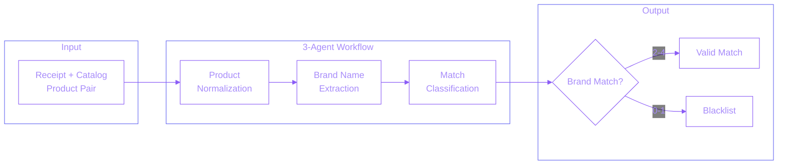

## Overview

Repurposed the 3-agent annotation workflow into a production auditing system that automatically flags incorrect product matches from the PAM-ML pipeline.

**How it works:** The PAM-ML pipeline matches receipt products to catalog items, but some matches are incorrect. This auditor runs the same 3-agent workflow used for training data annotation, but simplifies the output: labels 0-1 (brand mismatches) are flagged as false positives and added to a blacklist, preventing the pipeline from repeating the same errors.

**Why repurpose the annotation workflow?** The annotation workflow was already trained to evaluate match quality on a 0-4 scale. For auditing, we only need to identify bad matches (0-1), making it a natural fit. The agents and workflow were part of an internal LLM framework library (published to JFrog), so this auditor simply imports and uses them - avoiding building from scratch.

## Problem Statement

The PAM-ML pipeline matches receipt products to catalog items, but some matches are incorrect (false positives). These errors directly impact GMV by causing incorrect offer attribution. Challenges included:
- **Manual review bottleneck** - Team spending 8 hours daily reviewing matches
- **Scale** - Thousands of matches to audit weekly
- **Consistency** - Human reviewers had varying accuracy
- **GMV protection** - Incorrect matches directly impacted business revenue
- **Prioritization** - No way to focus on highest-risk matches first

## Technical Approach

Developed a Streamlit application with LLM-based classification:

### System Architecture

**3-Agent Agentic Workflow:**
1. **Product Normalization Agent** - Cleans and normalizes messy receipt/catalog descriptions
2. **Brand Name Agent** - Extracts and validates brand names from both sides
3. **Annotation Agent** - Classifies match quality on 0-4 scale

**Classification Scale (simplified for auditing):**
- **0-1: Blacklist** - Brand mismatch or incorrect product details
- **2-4: Valid** - Match is acceptable (overly specific, somewhat correct, or exact)

**Explainability Metadata:**
Each prediction includes reasoning from the annotation workflow:
- Normalized product descriptions
- Extracted brand names from both sides
- Decision tree trace showing classification path
- Justification for the assigned label

**Infrastructure:**
- Internal LLM framework (agents, workflows) imported from JFrog
- Streamlit web application for team access
- Google Sheets integration for workflow
- AWS CloudWatch for monitoring

## Key Achievements

- **95% recall** - Catches nearly all false positive matches
- **$800K GMV protected annually** - Prevents incorrect offer attribution
- **8 hours to 15 minutes** - Reduced daily audit effort by 97%
- **40 hours saved weekly** - Team reallocated to higher-value work
- **Production deployment** - Live on Fetch's Streamlit hub
- **Ensemble confidence** - Multi-inference scoring for reliability

## Technologies

**AI/ML:** Internal LLM framework (agents, workflows) from JFrog

**Frontend:** Streamlit

**Backend:** Python, Google Sheets API

**Infrastructure:** AWS CloudWatch, JFrog, Docker

## Impact

This system transformed the Receipt Quality team's workflow from reactive error-finding to proactive quality assurance. Flagged matches are added to a blacklist that prevents the PAM-ML pipeline from repeating the same incorrect matches, creating a continuous improvement loop. The $800K GMV protection demonstrates direct business value from ML-powered quality systems.
