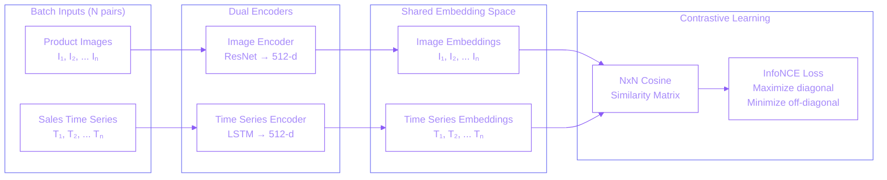
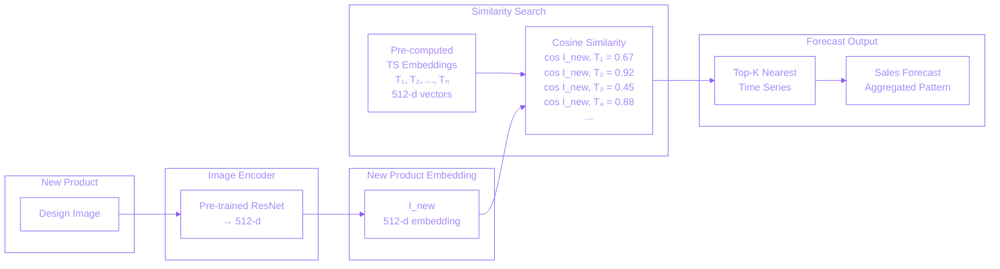

## Overview

Developed a CLIP-inspired multimodal contrastive learning pipeline to predict sales patterns for new fashion products before market launch. The system learns joint embeddings from product design images and historical sales time series, enabling demand forecasting for products with no sales history.

**How it works:** For existing products, we have both product images and historical sales time series. The system learns to map both modalities into a shared embedding space using contrastive learning. At inference, a new product's design image is encoded and we find the nearest time series embeddings in this shared space - those sales patterns become the forecast for the new product.

**Why contrastive learning?** Traditional forecasting requires historical sales data, which new products lack. By aligning image and time series representations in a shared space during training, we can bypass the image encoder at inference and directly retrieve similar sales patterns based on visual similarity.

## Problem Statement

Fashion brands needed to forecast demand for new products before launch to plan inventory and production. Challenges included:
- **Cold start problem** - New products have zero sales history
- **Design-to-demand gap** - No direct way to predict sales from product designs
- **Visual similarity** - Similar-looking products often have similar sales patterns
- **Production planning** - Forecasts needed months before launch
- **Inventory risk** - Over/under production costs for fashion items are high

## Technical Approach

Built a CLIP-style contrastive learning pipeline with two encoders:

### System Architecture

**Training Phase: Contrastive Learning**

The training phase uses dual encoders to map product images and sales time series into a shared 512-dimensional embedding space. The contrastive loss (InfoNCE) pulls matching pairs (I₁, T₁) together while pushing non-matching pairs apart, learning the relationship between visual design and sales patterns.

**Inference Phase: New Product Forecasting**

At inference, a new product's image is encoded into the same embedding space. Cosine similarity search finds the nearest time series embeddings from the pre-computed bank. The Top-K most similar sales patterns are retrieved and aggregated to generate the final demand forecast.

**Dual Encoder Architecture:**
- **Image Encoder** - CNN/ResNet/ViT for visual feature extraction from product images
- **Time Series Encoder** - LSTM for temporal pattern encoding of historical sales
- **Projection Heads** - Map both modalities to shared 512-d embedding space
- **Contrastive Loss (InfoNCE)** - Maximizes similarity for matching pairs (Iᵢ, Tᵢ), minimizes for non-matching (Iᵢ, Tⱼ)

**Key Implementation Details:**
- Training: Batch contrastive learning with N image-timeseries pairs
- Hard negative mining: Visually similar products with different sales patterns
- Inference: Pre-compute all time series embeddings for fast retrieval
- Aggregation: Weighted average of Top-K retrieved patterns based on similarity scores

## Key Achievements

- **Cold start solution** - Enabled forecasting for products with zero sales history
- **Visual-to-sales transfer** - Successfully mapped design similarity to demand patterns
- **Pre-launch planning** - Forecasts available months before product launch
- **Production adoption** - Used for inventory planning of new product lines

## Technologies

**Deep Learning:** PyTorch, Vision Transformers, CNN architectures

**Contrastive Learning:** CLIP-style architecture, InfoNCE loss

**Time Series:** Custom temporal encoders

**Data:** Product design images, sales time series

## Impact

This approach solved the fundamental cold-start problem in new product forecasting. Traditional methods require months of sales history before generating reliable forecasts. By learning the relationship between visual design and sales patterns, the system enabled demand planning from the moment a product design was finalized, significantly reducing inventory risk for new product launches.
