## Overview

A production-ready system that intelligently filters conversation history using semantic similarity before sending context to LLMs. Instead of including full conversation history (which grows quadratically in tokens), the system retrieves only semantically relevant context, reducing costs by 42% while maintaining response quality.

**How it works:** Each conversation turn is embedded and stored in a vector database. When generating a response, the system queries for messages semantically similar to the current query, filters by an adaptive threshold, and sends only relevant context to the LLM.

## Problem Statement

LLM applications face a fundamental challenge with conversation context:

- **Quadratic token growth** - Full conversation history grows expensive quickly
- **Context window limits** - Long conversations exceed model limits
- **Irrelevant context** - Old messages often confuse the model
- **Cost accumulation** - Every token costs money at scale
- **Latency impact** - More tokens mean slower responses

Traditional solutions like sliding windows or fixed-length truncation lose important context arbitrarily. We needed intelligent filtering that preserves relevance.

## Technical Approach

Built a semantic filtering pipeline using LangGraph for orchestration:

**System Architecture:**

```mermaid
%%{init: {'theme': 'base', 'themeVariables': { 'fontSize': '14px', 'primaryColor': 'transparent', 'primaryTextColor': '#a78bfa', 'primaryBorderColor': '#8b5cf6', 'lineColor': '#8b5cf6', 'secondaryColor': 'transparent', 'tertiaryColor': 'transparent', 'mainBkg': 'transparent', 'nodeBorder': '#8b5cf6', 'clusterBkg': 'transparent', 'clusterBorder': '#6366f1', 'titleColor': '#a78bfa'}}}%%
flowchart LR
    subgraph Input["User Query"]
        Query[New Message]
    end

    subgraph Filter["Semantic Filter"]
        direction TB
        Embed[Embed Query]
        Search[Vector Search<br/>pgvector + HNSW]
        Threshold[Adaptive<br/>Threshold]
    end

    subgraph Context["Relevant Context"]
        direction TB
        Relevant[Messages > 0.7<br/>similarity]
    end

    subgraph Generate["LLM Generation"]
        direction TB
        LLM[LLM Call<br/>58% fewer tokens]
        Save[Save to<br/>Memory Store]
    end

    Query --> Embed
    Embed --> Search
    Search --> Threshold
    Threshold --> Relevant
    Relevant --> LLM
    LLM --> Save
```

**Core Components:**

- **MemoryOptimizedAgent** - LangGraph workflow orchestrating the pipeline
- **BaseMemoryStore** - Pluggable interface for memory backends
- **PostgresMemoryStore** - Production store using pgvector with HNSW indexing
- **InMemoryStore** - Fast store for development/testing
- **AdaptiveThreshold** - Dynamic threshold adjustment based on retrieval patterns
- **LLMFactory** - Multi-provider support (OpenAI, Anthropic, Ollama)

**Key Implementation Details:**

- Sentence embeddings using `all-MiniLM-L6-v2` (384 dimensions)
- HNSW index for approximate nearest neighbor search
- Cosine similarity with configurable threshold (default 0.7)
- Q&A pairs stored as combined embeddings for better retrieval
- Async FastAPI endpoints for production deployment

## Key Achievements

- **42% cost reduction** - Fewer tokens sent to LLM per request
- **Sub-10ms filtering** - 7.8ms for 10 memories, 9.9ms for 500 memories
- **Linear scaling** - Performance degrades gracefully with memory size
- **1.5KB per conversation** - Efficient storage footprint
- **Production-ready** - Docker, Prometheus metrics, structured logging

## Technologies

**Core Stack:**
- Python, LangGraph, FastAPI
- PostgreSQL with pgvector extension
- Sentence-transformers for embeddings

**Infrastructure:**
- Docker Compose deployment
- Prometheus monitoring
- Structured JSON logging

**LLM Providers:**
- OpenAI, Anthropic, Ollama (configurable)

## Impact

This project demonstrates a practical solution to a common LLM application challenge. The 42% cost reduction compounds significantly at scale - for an application making 1M LLM calls/month, this approach can save thousands in API costs while actually improving response quality by filtering out irrelevant context.

The open-source implementation serves as a reference architecture for production AI systems requiring intelligent context management.
