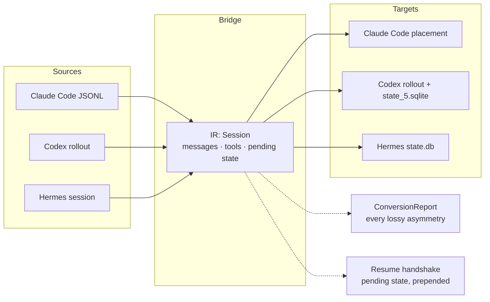

## Overview

Session Bridge moves a live coding-agent session between harnesses. Hit a usage limit mid-refactor in Claude Code, run one command, and continue the same conversation in Codex or Hermes with the history, tool calls, and unfinished work carried over. Everything runs against files already on disk. No cloud, no accounts.

The problem is that each harness writes an incompatible session log. Claude Code keeps threaded JSONL under a cwd-encoded directory, Codex writes OpenAI Responses shaped rollouts plus a SQLite index, and Hermes treats a SQLite database as the source of truth with JSONL as export. Built-in escape hatches are lossy plain-text exports. Session Bridge normalizes any of the three into one intermediate representation, renders it into the target shape, and then does the part that actually matters: it makes the target harness recognize the session as resumable.

## The Portability Model

The design bet is a single IR in the middle rather than three pairwise converters. Readers normalize, writers render, and two side channels carry what a naive converter drops.



Two properties make the resumed session trustworthy rather than merely present:

- **Losses are reported, never silent.** A ConversionReport names every asymmetry that could not transfer: flattened thread forks, dropped tool schemas, reasoning that survives only as summary text, erased permission posture. The report is computed against a per-target capability set, so adding a capability to one writer cannot silently change what another discloses.
- **Pending state travels.** If the source stopped mid-turn, the bridge detects open tool calls and queued user input, prepends a resume handshake describing them, and can stub synthetic interrupted results so the transcript is valid to the provider on the next turn. The receiving agent picks up deliberately instead of guessing.

## What Transfers, and What Does Not

The conversation core transfers between all three harnesses: user and assistant text, reasoning summaries, tool calls, tool results, and the linkage between them. Seven things are inherently asymmetric, and each is disclosed per conversion:

| Asymmetry | Behavior |
|-----------|----------|
| Thread topology | Only Claude Code has parent links; converting away flattens forks |
| Reasoning signatures | Provider-bound, reasoning survives as summary text |
| Tool schemas | Only Hermes stores them; reconstructed from invoked names otherwise |
| System instructions | Only Codex stores them |
| Queued user input | Only Claude Code records it; surfaced in the handshake |
| Permission posture | Richest in Codex, absent in Hermes |
| Per-turn model switches | Hermes stores one session model |

## Making the Target Believe It

A converted file sitting in the right directory is not enough for two of the three harnesses. Codex and Hermes index sessions in SQLite, so Session Bridge writes those rows too, and treats the mutation of a live store as the dangerous operation it is:

- The planning phase opens live stores read-only. A default SQLite connection can checkpoint the WAL of a database another process holds open, so validation and model inference connect with a read-only URI.
- Every registration takes a WAL-safe backup first, through the SQLite backup API rather than a file copy, and reports the backup path.
- Nothing is ever silently overwritten. An existing transcript, a duplicate session id, or a conflicting title fails closed with an explicit force path.
- Session ids are treated as untrusted input, validated before they ever reach a filesystem path or a database row, because ids can arrive from a source file rather than a person.

Resumability is verified against real installs, not assumed. A session was round-tripped Claude Code to Hermes to Claude Code and resumed in a live claude process that recalled a fact existing only in the converted transcript. Codex registration was verified with Codex CLI 0.145.0 the same way: a resumed session returned a sentinel that existed only in the imported history.

## The TUI

The CLI works but expects you to know which store your session lives in and which flags apply to which target. The Textual TUI removes that: it discovers sessions across all three stores, walks through target and options with only the valid fields visible, and ends every flow on a plan screen showing conversion notes, the backup plan, and the equivalent CLI command before any file or database is touched. The dry run is free because conversion is pure in-memory; writes are a separate confirmed step.

## Agents Can Drive It Too

The repo ships an agent skill, a markdown procedure any harness's agent can follow to hand off its own current session: locate the live transcript, inspect pending state, pick convert or register, and relay the resume command. One bootstrap command symlinks the skill into every harness present on the machine, so "hand this session off to Codex" works from any project:

```bash
session-bridge install-skill
# claude-code: linked — ~/.claude/skills/session-handoff
# codex: linked — ~/.codex/skills/session-handoff
# hermes: linked — ~/.hermes/skills/session-handoff
```

## Engineering Lessons

- **Schema archaeology beats schema guessing.** Every reader and registrar was built against real captured sessions and verified against live installs. The Hermes session id turned out to be the full filename stem, a detail the docs implied and a synthetic test had pinned wrong.
- **Adversarial review earns its cost on mutation code.** Independent review passes confirmed findings the test suite missed: the plan phase opening a live SQLite store read-write, a path expansion that could crash the UI through a never-raise boundary, markup injection from transcript content.
- **Demos are verification.** Recording the walkthrough GIF exposed a real usability bug, focus sat on Cancel while the confirm button was disabled, so pressing Enter on the dry-run screen silently cancelled. The fix shipped before the recording did.
- **Fail closed, disclose everything.** The most reusable design rule in the codebase: an operation that cannot preserve something must say so, and an operation that could destroy something must refuse until forced.

## Technologies

Python 3.11, stdlib-only core with zero runtime dependencies, Textual for the optional TUI, SQLite (WAL-safe backup API, read-only URIs, transactional registration), JSONL transcript formats for Claude Code, Codex, and Hermes, pytest with 298 tests including headless end-to-end TUI drives, and an agent-skill distribution model compatible with any SKILL.md-reading harness.
