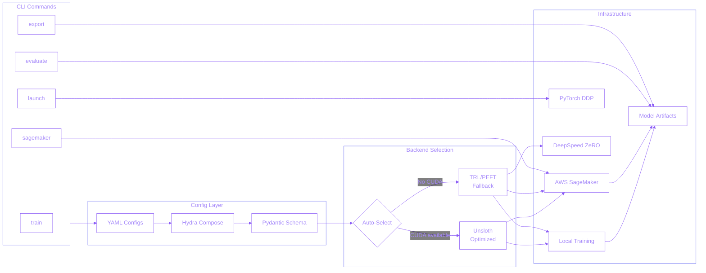

## Overview

An MLOps framework that provides a unified CLI for fine-tuning open-source LLMs. It abstracts away the complexity of multiple fine-tuning ecosystems (Unsloth, TRL/PEFT) with automatic backend selection, comprehensive AWS SageMaker integration, and best practices built-in for both local and cloud training workflows.

## Problem Statement

Fine-tuning open-source LLMs presents significant operational challenges:
- **Ecosystem fragmentation** - Engineers must learn multiple tools (Unsloth, TRL/PEFT) with different APIs
- **Configuration complexity** - Manual setup of distributed training (DDP, DeepSpeed), version compatibility nightmares
- **Cloud training barriers** - AWS SageMaker requires complex setup for multi-node training and spot instance handling
- **No unified interface** - Developers waste time stitching together tools and debugging integration issues

The ML engineering community needed a unified framework that provides production-grade capabilities out-of-the-box with minimal configuration.

## Technical Approach

Designed a layered architecture with automatic backend selection and comprehensive configuration management:

### System Architecture

**Core Architecture:**
- **Unified CLI Interface** - Single command-line tool with consistent API across all backends
- **Hydra + Pydantic Stack** - Type-safe configuration management with validation
- **Automatic Backend Selection** - CUDA available → Unsloth (optimized), CPU fallback → TRL
- **Protocol-Based Evaluation** - Pluggable evaluation framework supporting multiple backends (vLLM, HuggingFace)

**AWS SageMaker Integration:**
- Multi-node distributed training support with NCCL communication
- Spot instance orchestration with automatic retry logic (70-90% cost savings)
- Proper framework version management for gated models
- S3 checkpoint management and model artifact handling

**Optimization Stack:**
- DeepSpeed ZeRO stages (2, 3) for memory-efficient training
- LoRA/QLoRA with 4-bit quantization
- Gradient checkpointing for reduced memory footprint
- Sample packing for improved throughput
- Automatic chat template detection and formatting

## My Role

Served as sole architect and developer with complete ownership:
- Designed abstraction layer unifying 2 major fine-tuning ecosystems
- Implemented Hydra+Pydantic configuration system with type safety
- Built AWS SageMaker integration from scratch (multi-node, spot instances)
- Created distributed training support (DDP, DeepSpeed ZeRO)
- Developed protocol-based evaluation framework
- Wrote 129+ tests for production reliability
- Documented best practices and created sample configurations

## Key Achievements

- **44 samples/sec** - Achieved high throughput on 4x A10G GPUs with 4-bit quantization
- **70-90% cost reduction** - AWS SageMaker spot instances vs on-demand pricing
- **10.5% loss improvement** - Validated multi-GPU DDP training (1.43 → 1.28) over 3 epochs
- **2 ecosystem unification** - Single interface for Unsloth and TRL/PEFT backends
- **129+ test suite** - Comprehensive testing for production reliability
- **Zero-config operation** - Automatic backend selection based on available hardware
- **1B-70B+ model support** - Memory optimization enables training large models on consumer hardware

## Technologies

**ML Stack:** PyTorch, Transformers, Unsloth, TRL/PEFT

**Optimization:** LoRA/QLoRA, DeepSpeed ZeRO, 4-bit quantization, Gradient checkpointing

**Infrastructure:** AWS SageMaker, NCCL, vLLM

**Engineering:** Python, Hydra, Pydantic, uv package manager

## Technical Innovations

### 1. Automatic Backend Selection
Intelligent hardware detection that automatically chooses the optimal fine-tuning backend:
- Single GPU → Unsloth (2x faster than standard approaches)
- Multi-GPU → TRL with DDP for distributed training
- No manual configuration required

### 2. DDP Data Sharding Fix
Solved critical issues preventing proper data sharding across multiple GPUs in distributed training:
- Proper `torch.distributed` initialization with NCCL backend
- Automatic disabling of 4-bit quantization in DDP mode (incompatible with model wrapping)
- Correct device setup order required by NCCL
- Dynamic SFTConfig parameters for DistributedSampler integration

This fix enables true 4x speedup with 4 GPUs instead of redundant computation.

### 3. Protocol-Based Evaluation
Designed pluggable evaluation architecture supporting multiple backends (vLLM for fast batch inference, HuggingFace for flexibility) with custom metric implementations.

### 4. SageMaker Spot Instance Orchestration
Implemented robust spot instance handling with automatic retry logic, achieving 70-90% cost savings while maintaining training reliability through proper checkpoint management.

## Impact

This framework democratizes LLM fine-tuning by providing enterprise capabilities in an internal tool. The framework enables researchers and engineers to:
- **Rapid experimentation** - Zero-config operation reduces setup time from hours to minutes
- **Cost-efficient training** - Spot instances make cloud training accessible
- **Production reliability** - Comprehensive testing and error handling prevent common pitfalls
- **Ecosystem flexibility** - Switch backends without rewriting configurations

The project demonstrates deep MLOps expertise spanning distributed systems, cloud infrastructure, and ML framework internals.
